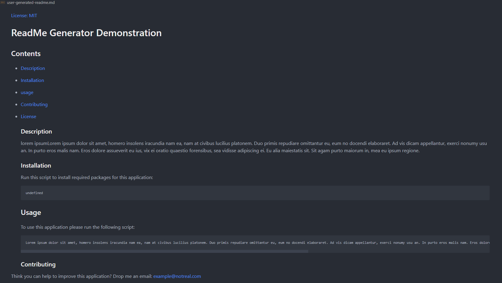

# ReadMe File Generator

## Table of contents

- [Walkthrough Video](#walkthrough-video)
- [GitHub Repository](#github-repository)
- [About The Application](#about-the-application)
  - [Technologies Used](#technologies-used)
  - [User Flow](#user-flow)
- [Contributors](#contributors)
- [Plans For Improvement](#plans-for-improvement)
- [Screenshots](#screenshots) -[Example Generated ReadMe](#example-generated-readme)

## Walkthrough Video

Click [here]() to view my walkthrough video on how to use this application

## GitHub Repository

Click [here](https://github.com/tigerbath/readme-generator) to visit the GitHub Repository for this application

## About The Application

This application was designed to provide a quick alternative to creating clean, concise and uniform readme.md files for any project the user chooses to create. Once the user has installed the package, they start the application by typing 'npm run start', they will then be prompted with a number of questions. Once the user has given answers to these questions a completed generated readme file is filed in the 'user-generated-readme.md' file.

## Technologies Used

JavaScript - inquirer.npm - node.js

## User flow

AS a user
I want to install the package
SO that when I run npm run start
A number of questions are prompted for me to answer
ONCE I have completed the questions
A readme is generated for me to use

## Contributors

- [Matt Palmer](https://github.com/tigerbath)
- [Suraj Verma](https://github.com/surajverma2587)

## Plans For Improvement

- I would like to add increased versatility to this application, improving the license badge library to hold many more
- I would like to add the option to import media such as screenshots into this application

## Screenshots

- Example Generated ReadMe
  
